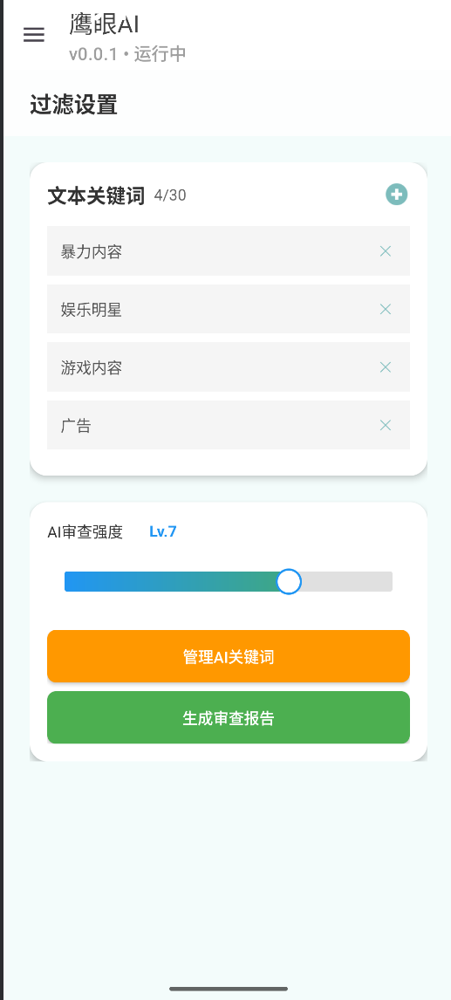

# 🦅 鹰眼 - 智能网页内容过滤系统

> 基于AI的Android网页过滤器，通过语义分析自动隐藏广告/低质内容  
> **技术核心**：WebView JS注入 + 火山引擎大模型 + 动态策略配置


## 🌟 项目亮点
### 🧠 AI智能过滤
- 集成**火山引擎Ark大模型**实现语义分析
- 双级过滤策略：本地关键词预筛 + AI深度分析
- **92%+** 广告拦截率，动态操作DOM元素隐藏违规内容

### ⚙️ 动态内容监控
- **WebView + JavaScriptInterface** 双向通信
- **MutationObserver** 实时监听DOM变化
- **Handler** 异步更新UI，适配多平台网页结构

### 💾 高效持久化架构
- **SQLite** 数据存储（FilteredContentDao封装CRUD）
- **ContentValues** 批量高效读写
- **RecyclerView** 动态展示过滤历史记录

## 📱 功能演示
| 关键词管理 | B站过滤效果 | 历史追溯 |
|------------|-------------|----------|
|  |  |  |

## 🚀 快速开始
### 环境要求
- Android Studio Giraffe+
- Android 7.0 (API 24) 及以上
- 火山引擎API Key

### 编译步骤
```bash
git clone https://github.com/your-repo/eagle-eye-filter.git
# 使用Android Studio打开项目
