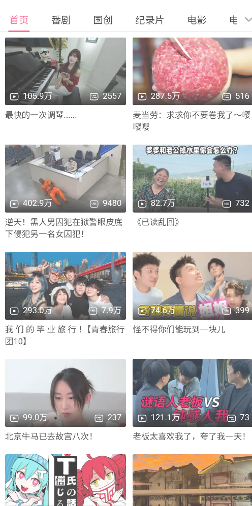
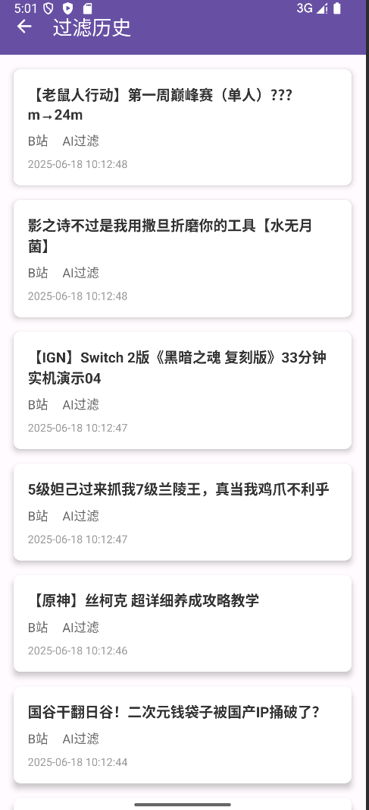

# 🦅 鹰眼 - 智能网页内容过滤系统

> 基于AI的Android网页过滤器，通过语义分析自动隐藏广告/低质内容  
> **技术核心**：WebView JS注入 + 火山引擎大模型 + 动态策略配置


## 🌟 项目亮点
### 🧠 AI智能过滤
- 集成**火山引擎Ark大模型**实现语义分析
- 双级过滤策略：本地关键词预筛 + AI深度分析
- **92%+** 广告拦截率，动态操作DOM元素隐藏违规内容

### ⚙️ 动态内容监控
- **WebView + JavaScriptInterface** 双向通信
- **MutationObserver** 实时监听DOM变化
- **Handler** 异步更新UI，适配多平台网页结构

### 💾 高效持久化架构
- **SQLite** 数据存储（FilteredContentDao封装CRUD）
- **ContentValues** 批量高效读写
- **RecyclerView** 动态展示过滤历史记录

## 📱 功能演示
| 关键词管理 | B站过滤效果 | 历史追溯 |
|------------|-------------|----------|
|  |  |  |

## 🚀 快速开始
### 环境要求
- Android Studio Giraffe+
- Android 7.0 (API 24) 及以上
- 火山引擎API Key

### 编译步骤
```bash
git clone https://github.com/your-repo/eagle-eye-filter.git
# 使用Android Studio打开项目

### 核心配置
1. 在 `ChatCompletionService.java` 添加API Key：
```java
ArkService.builder()
    .apiKey("your_volc_engine_api_key") // 👈 替换此处
    .build();
```

2. 配置网页适配规则（可选）：
```java
// BiliActivity.java
const selector = "div.v-card"; // B站卡片选择器

// BaiduActivity.java
const selector = "a.rn-large-tpl, a.rn-tpl"; // 百度卡片选择器
```

## 🧩 核心模块
| 模块 | 文件 | 功能描述 |
|------|------|----------|
| **网页过滤** | `BiliActivity.java`<br>`BaiduActivity.java` | WebView控制层，实现JS注入与DOM操作 |
| **AI服务** | `ChatCompletionService.java` | 火山引擎API调用与响应处理 |
| **数据管理** | `FilteredContentDao.java` | SQLite数据库CRUD操作封装 |
| **历史记录** | `FilterHistoryActivity.java` | 过滤历史展示界面 |
| **关键词系统** | `KeywordManager.java` | 单例模式管理过滤词库 |

## 🛠️ 二次开发
### 扩展新平台
1. 新建Activity继承 `BaseWebActivity`
2. 实现DOM选择器逻辑：
```java
public class WeiboActivity extends BaseWebActivity {
    @Override
    protected String getCardSelector() {
        return "div.card-wrap"; // 微博卡片选择器
    }
    
    @Override
    protected String getTitleSelector() {
        return "p.card-text"; // 标题选择器
    }
}
```

### 调整过滤策略
在 `KeywordManager.java` 修改提示词模板：
```java
public String getPromptPrefix() {
    return "请判断内容是否涉及以下敏感主题：\n关键词：" 
        + String.join("、", keywords); // ✨ 自定义提示词
}
```

## 📜 开源协议
本项目采用 [MIT License](LICENSE)，欢迎贡献代码！
```


